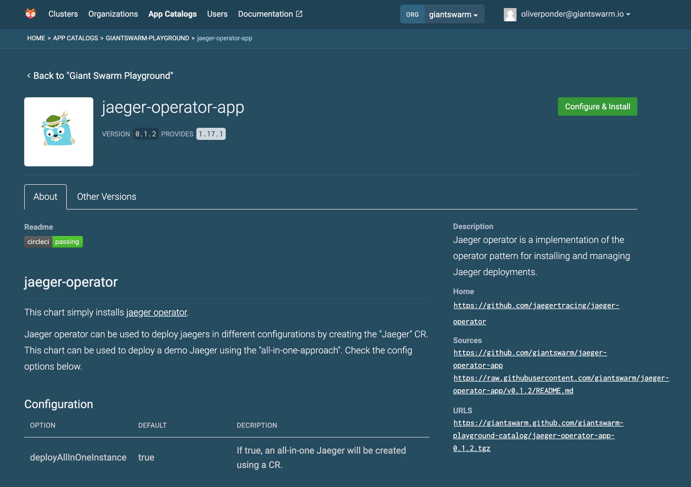

Your beautiful app deserves to look beautiful in Happa as well. Here are some
tips and tricks on how to set the Chart.yaml values of your app so that the
frontend can show relevant information in a pleasing way.



## It's in the Chart.yaml

The metadata that Happa eventually sees starts in the Chart.yaml in the app's
repository.

Here is an example from `jaeger-operator`:

```yaml
# Chart.yaml

apiVersion: v2
appVersion: 1.17.1
version: [[ .Version ]]
name: jaeger-operator
description: |
  Jaeger operator is a implementation of the operator pattern for installing
  and managing Jaeger deployments.
home: https://github.com/giantswarm/jaeger-operator-app
icon: https://s.giantswarm.io/app-icons/1/png/jaeger-operator-app-dark.png
kubeVersion: ^1.15.0-0
sources:
- https://github.com/jaegertracing/jaeger-operator
annotations:
  application.giantswarm.io/readme: https://raw.githubusercontent.com/giantswarm/jaeger-operator-app/v[[ .Version ]]/README.md
  application.giantswarm.io/team: team-cabbage
```

[View Chart.yaml in Github](https://github.com/giantswarm/jaeger-operator-app/blob/master/helm/jaeger-operator-app/Chart.yaml)


### Icon

If you add a URL to a PNG or SVG file in the `icon` field, then
happa will attempt to fetch it and use it when showing
your app.

We publish app icons through [web-assets](https://github.com/giantswarm/web-assets). Find them in the [`assets/app-icons`](https://github.com/giantswarm/web-assets/tree/master/assets/app-icons) folder.

An example icon url would be `https://s.giantswarm.io/app-icons/1/png/jaeger-operator-app-dark.png`

#### Providing an app icon for light and dark backgrounds

Since our app catalog UI in happa (our web UI) shows app icons on a dark background, there is a chance that an icon/logo would end up invisible because it uses black on a dark blue background. To avoid this, you can provide two versions of the icon file and name the files following a specific pattern.

Example:

- Light background version: https://s.giantswarm.io/app-icons/rbac-bootstrap/1/light.svg
- Dark background version: https://s.giantswarm.io/app-icons/rbac-bootstrap/1/dark.svg

Here is how that works.

1. Make two versions of the app icon. One that works on a light background, one that works on a dark background.
2. Store the one that works on light background with a file name ending in `light.svg` or `light.png`.
3. Store the one that works on dark background with a file name ending in `dark.svg` or `dark.png`.
4. In the app metadata, reference the URL ending in `light.svg` or `light.png`.

**Note:** Please use either the SVG or PNG file format. Make sure to use lowercase file names. Make sure both file names only differ in the end at `(light|dark).(svg|png)` and the files reside in the same folder.

### Readme

Happa will attempt to fetch the url in the value of annotation `application.giantswarm.io/readme`
and display it when users visit the detail page of that app.

Apps packaged using CircleCI job `push-to-app-catalog` with [`executor: "app-build-suite"`](https://github.com/giantswarm/architect-orb/blob/master/docs/job/push-to-app-catalog.md#executor-optional-either-architect-or-app-build-suite-defaultarchitect)
automatically include an annotation with key `application.giantswarm.io/readme`
which points to a versioned copy of the apps README residing in the app catalog.

You can find more information about app metadata in spec [Representation of apps and their metadata for app catalog entries](https://intranet.giantswarm.io/docs/product/architecture-specs-adrs/specs/managed-apps/2020-05-05-app-versions-representation/).

In case you're not using [`app-build-suite`](https://github.com/giantswarm/app-build-suite), it is possible to manually add
an annotation called `application.giantswarm.io/readme` to `Chart.yaml`.

To make sure users see a README that matches the version of the app they
are currently looking at, you can `[ .Version ]` to template it in.

Example:
```
annotations:
  application.giantswarm.io/readme: https://raw.githubusercontent.com/giantswarm/jaeger-operator-app/v[[ .Version ]]/README.md
```

Adding a README really ties the whole thing together for people that are trying
to use the app. Use it to help people understand what the app will actually do,
and what values to supply in order to get a working deployment.

Sample readme outline:

1. Installing
2. Configuration
   1. Sample values files for the web interface and API
   2. Sample App CR and ConfigMap for the management cluster
   3. Configuration Options Reference (link to more information)
3. Compatability
4. Limitations
5. For developers
