## Icons

You can download the entire collection as a [ZIP archive](gs23-icons-v1.01.zip).

 airplane - [SVG](svg/gs23-icon-airplane.svg) [PNG](png/gs23-icon-airplane.png)

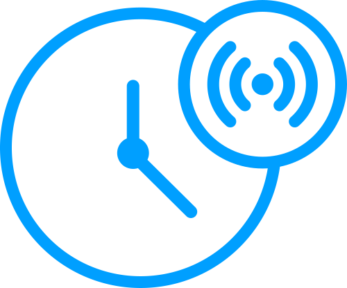 alert - [SVG](svg/gs23-icon-alert.svg) [PNG](png/gs23-icon-alert.png)

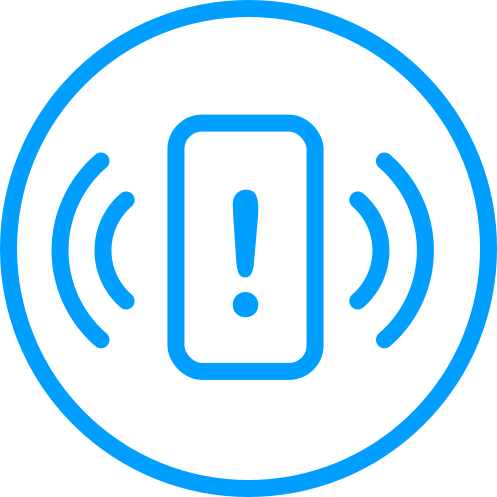 alert2 - [SVG](svg/gs23-icon-alert2.svg) [PNG](png/gs23-icon-alert2.png)

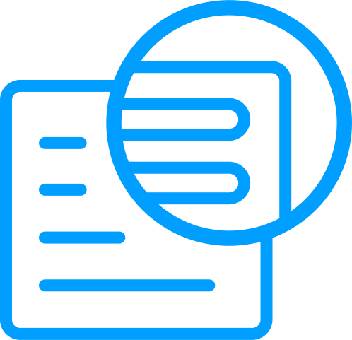 analysis - [SVG](svg/gs23-icon-analysis.svg) [PNG](png/gs23-icon-analysis.png)

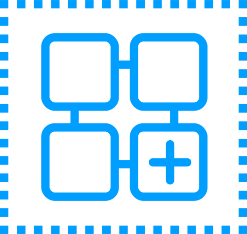 app - [SVG](svg/gs23-icon-app.svg) [PNG](png/gs23-icon-app.png)

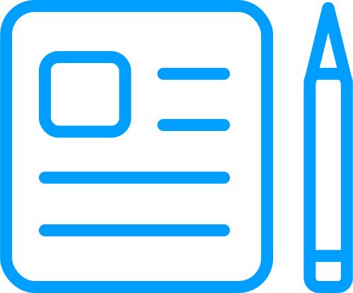 article - [SVG](svg/gs23-icon-article.svg) [PNG](png/gs23-icon-article.png)

 automation - [SVG](svg/gs23-icon-automation.svg) [PNG](png/gs23-icon-automation.png)

 calendar - [SVG](svg/gs23-icon-calendar.svg) [PNG](png/gs23-icon-calendar.png)

 chat - [SVG](svg/gs23-icon-chat.svg) [PNG](png/gs23-icon-chat.png)

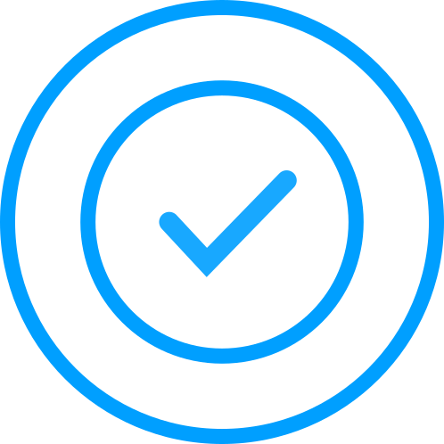 check - [SVG](svg/gs23-icon-check.svg) [PNG](png/gs23-icon-check.png)

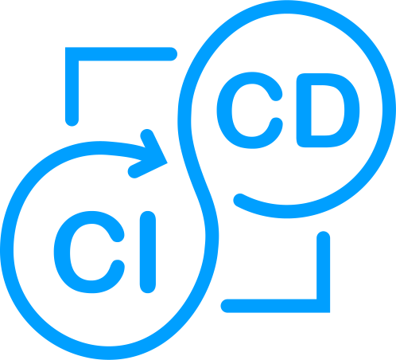 cicd - [SVG](svg/gs23-icon-cicd.svg) [PNG](png/gs23-icon-cicd.png)

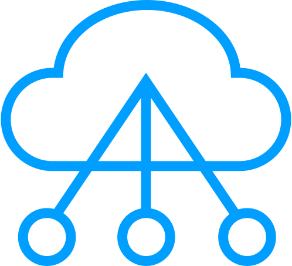 cloud-migration - [SVG](svg/gs23-icon-cloud-migration.svg) [PNG](png/gs23-icon-cloud-migration.png)

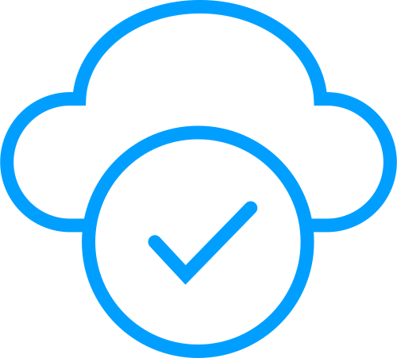 cloud-optimization - [SVG](svg/gs23-icon-cloud-optimization.svg) [PNG](png/gs23-icon-cloud-optimization.png)

 cloud-scaling - [SVG](svg/gs23-icon-cloud-scaling.svg) [PNG](png/gs23-icon-cloud-scaling.png)

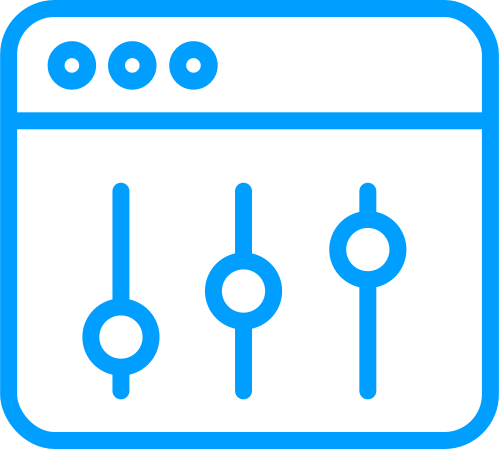 controls - [SVG](svg/gs23-icon-controls.svg) [PNG](png/gs23-icon-controls.png)

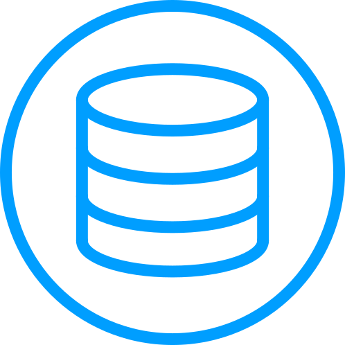 database - [SVG](svg/gs23-icon-database.svg) [PNG](png/gs23-icon-database.png)

 developer - [SVG](svg/gs23-icon-developer.svg) [PNG](png/gs23-icon-developer.png)

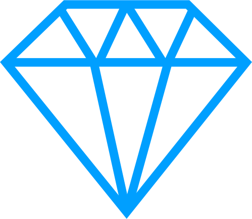 diamond - [SVG](svg/gs23-icon-diamond.svg) [PNG](png/gs23-icon-diamond.png)

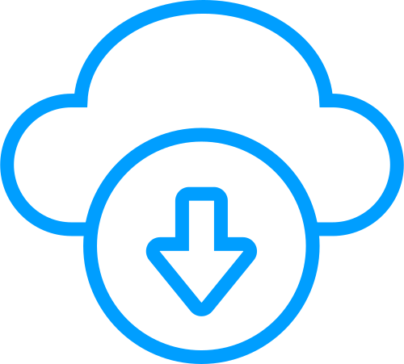 download - [SVG](svg/gs23-icon-download.svg) [PNG](png/gs23-icon-download.png)

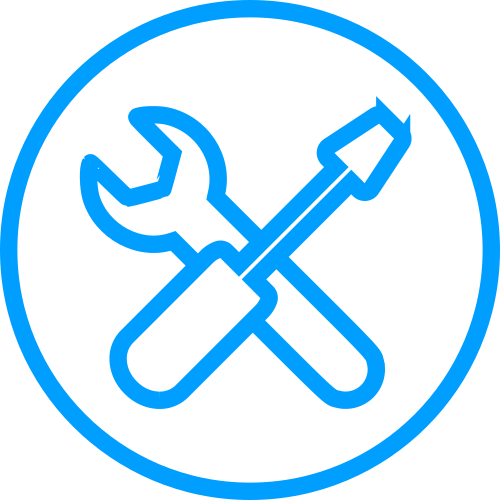 diy - [SVG](svg/gs23-icon-diy.svg) [PNG](png/gs23-icon-diy.png)

 envelope - [SVG](svg/gs23-icon-envelope.svg) [PNG](png/gs23-icon-envelope.png)

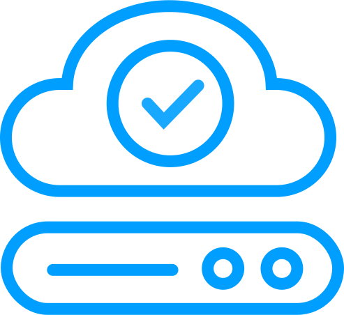 environments - [SVG](svg/gs23-icon-environments.svg) [PNG](png/gs23-icon-environments.png)

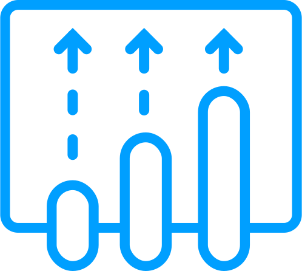 evolution - [SVG](svg/gs23-icon-evolution.svg) [PNG](png/gs23-icon-evolution.png)

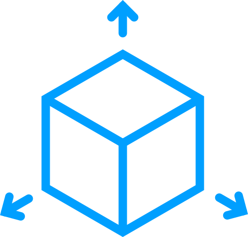 flexibility - [SVG](svg/gs23-icon-flexibility.svg) [PNG](png/gs23-icon-flexibility.png)

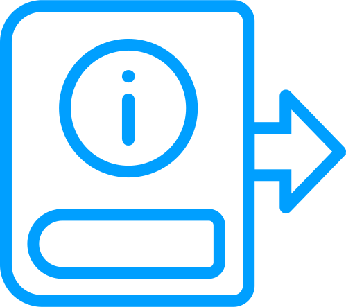 guide - [SVG](svg/gs23-icon-guide.svg) [PNG](png/gs23-icon-guide.png)

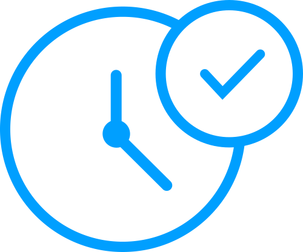 issue-resolution - [SVG](svg/gs23-icon-issue-resolution.svg) [PNG](png/gs23-icon-issue-resolution.png)

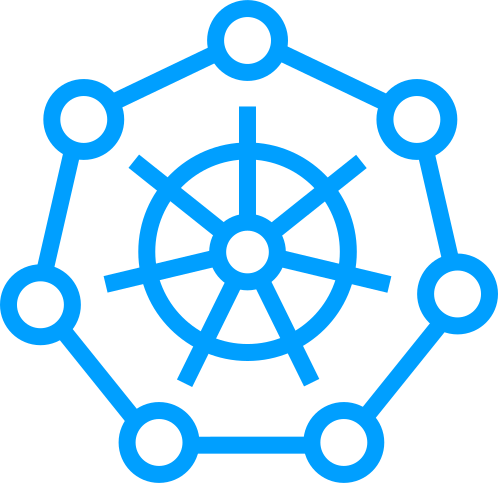 kubernetes - [SVG](svg/gs23-icon-kubernetes.svg) [PNG](png/gs23-icon-kubernetes.png)

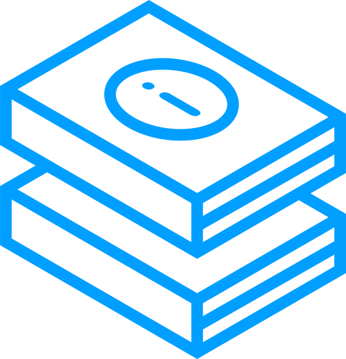 learn - [SVG](svg/gs23-icon-learn.svg) [PNG](png/gs23-icon-learn.png)

 link - [SVG](svg/gs23-icon-link.svg) [PNG](png/gs23-icon-link.png)

 lock - [SVG](svg/gs23-icon-lock.svg) [PNG](png/gs23-icon-lock.png)

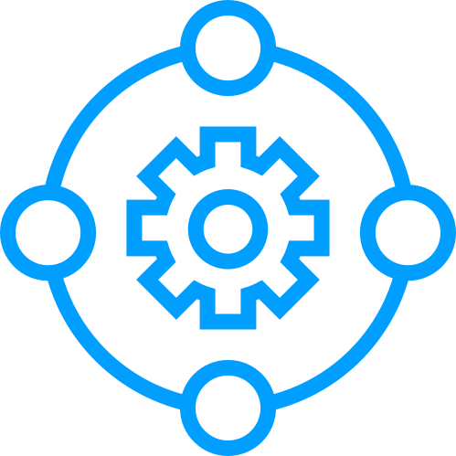 management-cluster - [SVG](svg/gs23-icon-management-cluster.svg) [PNG](png/gs23-icon-management-cluster.png)

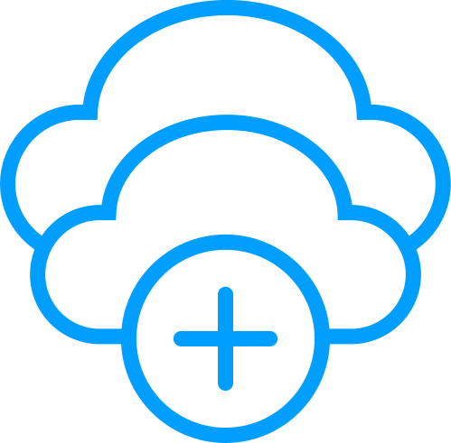 multi-cloud - [SVG](svg/gs23-icon-multi-cloud.svg) [PNG](png/gs23-icon-multi-cloud.png)

 open-source - [SVG](svg/gs23-icon-open-source.svg) [PNG](png/gs23-icon-open-source.png)

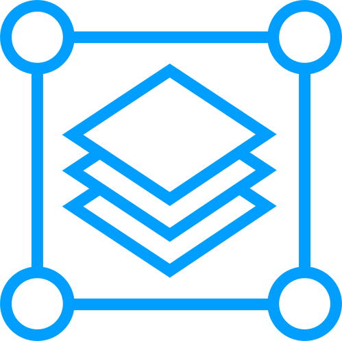 platform - [SVG](svg/gs23-icon-platform.svg) [PNG](png/gs23-icon-platform.png)

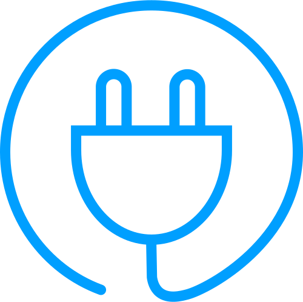 plug-in - [SVG](svg/gs23-icon-plug-in.svg) [PNG](png/gs23-icon-plug-in.png)

 podcast - [SVG](svg/gs23-icon-podcast.svg) [PNG](png/gs23-icon-podcast.png)

 post-mortem - [SVG](svg/gs23-icon-post-mortem.svg) [PNG](png/gs23-icon-post-mortem.png)

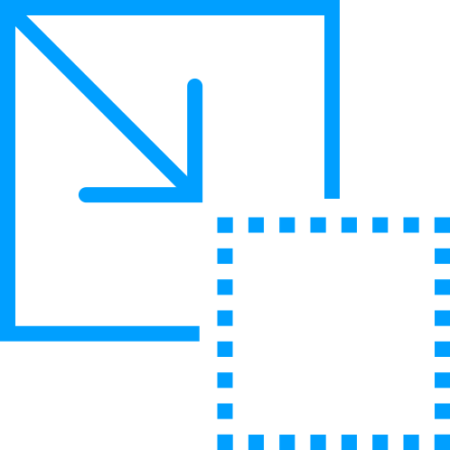 reduce - [SVG](svg/gs23-icon-reduce.svg) [PNG](png/gs23-icon-reduce.png)

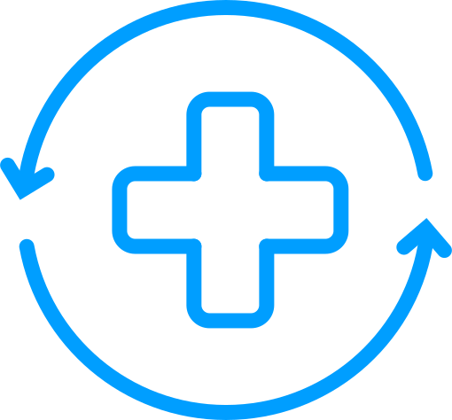 repair - [SVG](svg/gs23-icon-repair.svg) [PNG](png/gs23-icon-repair.png)

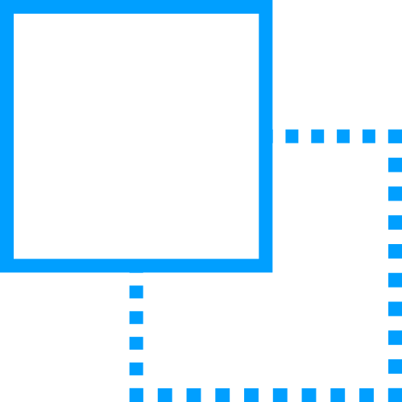 replace - [SVG](svg/gs23-icon-replace.svg) [PNG](png/gs23-icon-replace.png)

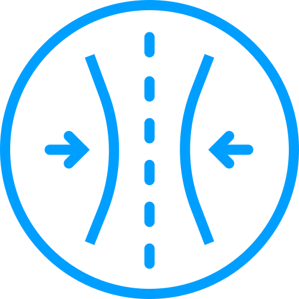 resiliency - [SVG](svg/gs23-icon-resiliency.svg) [PNG](png/gs23-icon-resiliency.png)

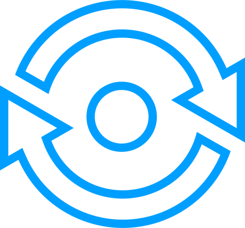 reuse - [SVG](svg/gs23-icon-reuse.svg) [PNG](png/gs23-icon-reuse.png)

 secure-cloud - [SVG](svg/gs23-icon-secure-cloud.svg) [PNG](png/gs23-icon-secure-cloud.png)

 speaker - [SVG](svg/gs23-icon-speaker.svg) [PNG](png/gs23-icon-speaker.png)

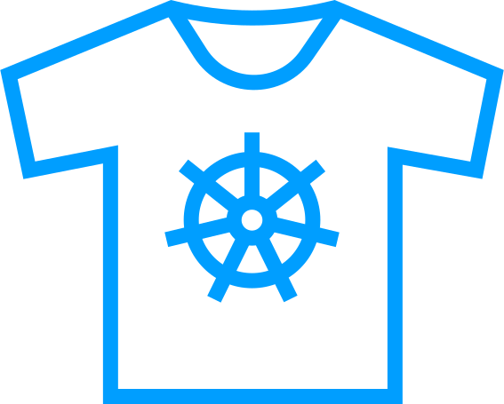 swag - [SVG](svg/gs23-icon-swag.svg) [PNG](png/gs23-icon-swag.png)

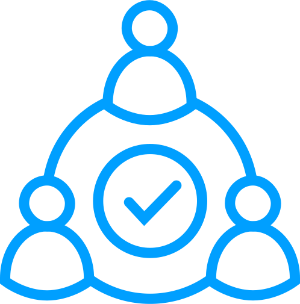 team - [SVG](svg/gs23-icon-team.svg) [PNG](png/gs23-icon-team.png)

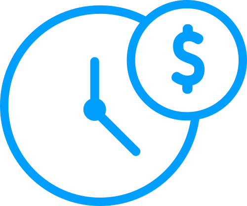 time - [SVG](svg/gs23-icon-time.svg) [PNG](png/gs23-icon-time.png)

 unlock - [SVG](svg/gs23-icon-unlock.svg) [PNG](png/gs23-icon-unlock.png)

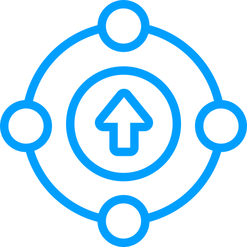 uptime - [SVG](svg/gs23-icon-uptime.svg) [PNG](png/gs23-icon-uptime.png)

 video - [SVG](svg/gs23-icon-video.svg) [PNG](png/gs23-icon-video.png)

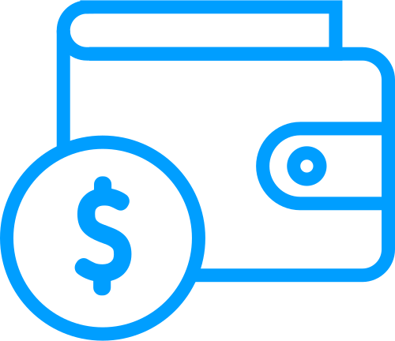 wallet - [SVG](svg/gs23-icon-wallet.svg) [PNG](png/gs23-icon-wallet.png)

 webinar - [SVG](svg/gs23-icon-webinar.svg) [PNG](png/gs23-icon-webinar.png)
