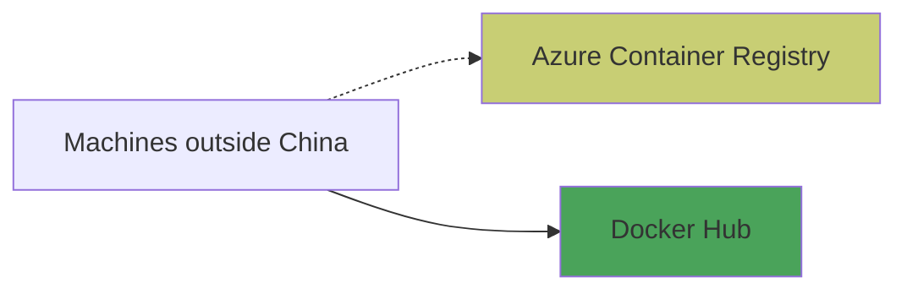

## Why do we need to use registry mirrors?

In the past, our setup relied on two registries being available: Quay globally, and Aliyun in China.

This presented 2 single points of failure. Specifically, if Quay was unavailable to pull images from, then clusters outside China couldn't be created or scaled (as the images needed to start a node were unavailable). The same was true for Aliyun and clusters in China.

Given a number of Quay outages in Q2 2020, we decided that these single points of failure were too risky long-term.

## Why do we not run our own registries?

One possible solution to Quay not providing the service level we want is to run our own registry / registries. This could have consisted of a single global registry, one registry per region, running a registry per management cluster, or various other topologies.

We discounted this due to the effort of providing the necessarily high maintenance effort, regardless of the overall topology - i.e: that registry would need to be highly available, and the team felt that providing that service would take an unreasonable amount of our time and energy, compared to other solutions.

## What are registry mirrors, and how do they work?

containerd can be configured with a set of _registry mirrors_. When a user attempts to pull an image, the daemon will try the endpoints in the configured order. For example, for `docker.io/...` images, we could configure to try Docker Hub first but fall back to a mirror in case of an error (e.g. service down, rate limit).

This is helpful in our situation in that it allows us to use multiple registries, instead of relying on one registry. When relying on one registry, that singular registry must have a very high uptime. When we are using multiple registries, we can tolerate a failure of one registry much better.

See [here](https://github.com/containerd/containerd/blob/main/docs/hosts.md#server-field) for containerd's documentation on registry mirrors.

Before the switch to containerd, we used the Docker daemon which tries the configured mirrors first (see [their documentation](https://docs.docker.com/registry/recipes/mirror/)).

## Why do we need to use Docker Hub images?

Since we switched to containerd, this should not be a problem anymore. Depending on the cluster app template (such as [`cluster-aws`](https://github.com/giantswarm/cluster-aws)), we offer configuring registries which are not Docker Hub, including the option to list mirror endpoints.

Previously, we used the Docker daemon which only supported registry mirrors when using images hosted on Docker Hub, i.e: `redis`, `datadog/agent`, `docker.io/redis`, or `docker.io/datadog/agent`. This is documented [here](https://docs.docker.com/registry/recipes/mirror/#gotcha). If registry mirrors are configured and a user attempts to pull an image from a registry that is not Docker Hub, i.e: `quay.io/giantswarm/aws-operator`, the mirrors are not considered and the daemon pulls only from the specific registry (`quay.io` in this case).

We tend to use image names that contain `docker.io` - for example, `docker.io/giantswarm/hyperkube` over `giantswarm/hyperkube` - to make templating easier.

## Why can't we use Quay / other public registries as a registry mirror?

If configured, containerd attempts to use the configured registry mirrors for images on Docker Hub. For example, given the image `datadog/agent` (shorthand for `docker.io/datadog/agent`) and Quay configured as a registry mirror, the daemon might attempt to pull the image `quay.io/datadog/agent` if Docker Hub is unavailable or returns a temporary rate limit failure. This image does not exist, so the daemon can only use the primary endpoint (Docker Hub), but not Quay.

However, a malicious actor could create the repository `quay.io/datadog/agent` - or other popular images - and place malicious images there. These could then be picked up by the daemon and run.

This issue extends to all other public registries. Due to the multi-tenancy of our clusters (i.e: we can't control which images our customers use), any public registry would pose the same security issue.

We address this by only using Giant Swarm-controlled registries, which only have our images. Malicious actors can't place their own images on these registries. For example, we have `docker.io/giantswarm/kube-apiserver:v1.24.10` which is also available on the mirror `giantswarm.azurecr.io/giantswarm/kube-apiserver:v1.24.10`.

## What Giant Swarm-controlled registry mirrors are we using?

We are using Azure Container Registry (ACR) as a Giant Swarm-controlled registry outside of China. The domain `giantswarm.azurecr.io` is for images while `giantswarmpublic.azurecr.io` is for app catalogs.

This is configured as a registry mirror, and we synchronise images between Docker Hub and Azure Container Registry (ACR).

## Why don't we support registry mirrors in China?

We have not found a suitable private registry in China yet.

## Why don't we use X as a Giant Swarm-controlled registry?

- We are not using Amazon Elastic Container Registry (ECR) as it does not support anonymous pulling of images.
- We don't use Azure Container Registry (ACR) in China as it requires us to set up a Chinese business entity.
- We don't host our own registry to avoid the investment of running a registry.

## Why are we only using public images?

When using registry mirrors, the Docker daemon attempts to use the same credentials for all registries. To avoid unnecessary complications aligning credentials across registries, and as all our work is open-source, it's more straightforward to only use public images.

We can still use private images, just without the benefits of registry mirrors.

Having switched to containerd which allows setting separate credentials per endpoint, this should not be a problem anymore but images remain public for the above historical reasons.

## What images are being synchronised?

We are currently synchronising all images needed for node bootstrap, e.g: `hyperkube`.

We are only synchronising tagged images, not all SHAs - this is to avoid synchronising a very large number of unnecessary images.

## How are images synchronised between registries?

We use the tool [crsync](https://github.com/giantswarm/crsync) to synchronise images between registries. This is deployed on the Operations Platform.

This shows the general state of our registries before our migration. On the whole, CI pushed to both Quay and Aliyun.

Initially, we are synchronising between Quay and Docker Hub and Azure Container Registry (ACR). This is to reduce the work required - we don't need to get rid of Quay yet.

In the future, we'd like to reuse crysnc for synchronising images between Quay and Aliyun. This makes CI workflows simpler and quicker.

In the much further future, we'd like to get rid of Quay entirely, and only use Docker Hub.

## Which registries do which machines use?

Machines outside of China use registry mirroring. Azure Container Registry is set as the mirror. This means that machines will attempt to pull images from Docker Hub first, and fall back to Azure Container Registry in case of errors.

For old clusters that still use the Docker daemon instead of containerd, the mirror will be attempted first.

Machines in China do not use registry mirroring, so pull all the images from Aliyun.

